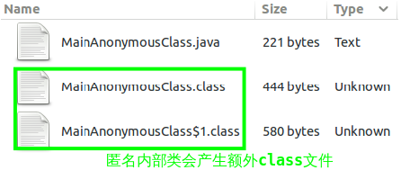
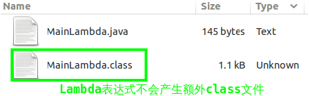

# Lambda and Anonymous Classes(II)

# 前言

读过上一篇之后，相信对Lambda表达式的语法以及基本原理有了一定了解。对于编写代码，有这些知识已经够用。本文将**进一步区分Lambda表达式和匿名内部类在JVM层面的区别，如果对这一部分不感兴趣，可以跳过**。

# 不是匿名内部类的简写

经过第一篇的的介绍，我们看到Lambda表达式似乎只是为了简化匿名内部类书写，这看起来仅仅通过语法糖在编译阶段把所有的Lambda表达式替换成匿名内部类就可以了。但实时并非如此。在JVM层面，Lambda表达式和匿名内部类有着明显的差别。

## 匿名内部类实现

**匿名内部类仍然是一个类，只是不需要程序员显示指定类名，编译器会自动为该类取名**。因此如果有如下形式的代码，编译之后将会产生两个class文件：

```java
public class MainAnonymousClass {
	public static void main(String[] args) {
		new Thread(new Runnable(){
			@Override
			public void run(){
				System.out.println("Anonymous Class Thread run()");
			}
		}).start();;
	}
}
```
编译之后文件分布如下，两个class文件分别是主类和匿名内部类产生的：



进一步分析主类MainAnonymousClass.class的字节码，可发现其创建了匿名内部类的对象：

```java
// javap -c MainAnonymousClass.class
public class MainAnonymousClass {
  ...
  public static void main(java.lang.String[]);
    Code:
       0: new           #2                  // class java/lang/Thread
       3: dup
       4: new           #3                  // class MainAnonymousClass$1 /*创建内部类对象*/
       7: dup
       8: invokespecial #4                  // Method MainAnonymousClass$1."<init>":()V
      11: invokespecial #5                  // Method java/lang/Thread."<init>":(Ljava/lang/Runnable;)V
      14: invokevirtual #6                  // Method java/lang/Thread.start:()V
      17: return
}

```
## Lambda表达式实现

**Lambda表达式通过*invokedynamic*指令实现，书写Lambda表达式不会产生新的类**。如果有如下代码，编译之后只有一个class文件：

```java
public class MainLambda {
	public static void main(String[] args) {
		new Thread(
				() -> System.out.println("Lambda Thread run()")
			).start();;
	}
}
```
编译之后的结果：



通过javap反编译命名，我们更能看出Lambda表达式内部表示的不同：

```java
// javap -c -p MainLambda.class
public class MainLambda {
  ...
  public static void main(java.lang.String[]);
    Code:
       0: new           #2                  // class java/lang/Thread
       3: dup
       4: invokedynamic #3,  0              // InvokeDynamic #0:run:()Ljava/lang/Runnable; /*使用invokedynamic指令调用*/
       9: invokespecial #4                  // Method java/lang/Thread."<init>":(Ljava/lang/Runnable;)V
      12: invokevirtual #5                  // Method java/lang/Thread.start:()V
      15: return

  private static void lambda$main$0();  /*Lambda表达式被封装成主类的私有方法*/
    Code:
       0: getstatic     #6                  // Field java/lang/System.out:Ljava/io/PrintStream;
       3: ldc           #7                  // String Lambda Thread run()
       5: invokevirtual #8                  // Method java/io/PrintStream.println:(Ljava/lang/String;)V
       8: return
}

```

反编译之后我们发现Lambda表达式被封装成了主类的一个私有方法，并通过*invokedynamic*指令进行调用。

## 推论，this引用的意义

既然Lambda表达式不是内部类的简写，那么Lambda内部的`this`引用也就跟内部类对象没什么关系了。在Lambda表达式中`this`的意义跟在表达式外部完全一样。因此下列代码将输出两遍`Hello Hoolee`，而不是两个引用地址。

```Java
public class Hello {
	Runnable r1 = () -> { System.out.println(this); };
	Runnable r2 = () -> { System.out.println(toString()); };
	public static void main(String[] args) {
		new Hello().r1.run();
		new Hello().r2.run();
	}
	public String toString() { return "Hello Hoolee"; }
}
```

## 参考文献

http://cr.openjdk.java.net/~briangoetz/lambda/lambda-state-final.html


