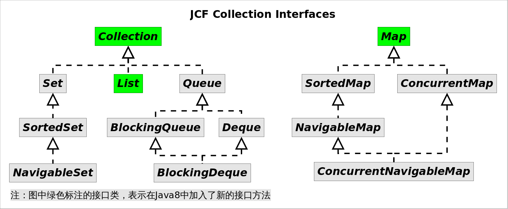

# Lambda and Collections

我们先从最熟悉的*Java集合框架(Java Collections Framework, JCF)*开始说起。

为引入Lambda表达式，Java8新增了`java.util.funcion`包，里面包含常用的**函数接口**，这是Lambda表达式的基础，Java集合框架也新增部分接口，以便与Lambda表达式对接。

首先回顾一下Java集合框架的接口继承结构：



上图中绿色标注的接口类，表示在Java8中加入了新的接口方法，当然由于继承关系，他们相应的子类也都会继承这些新方法。下表详细列举了这些方法。

| 接口名 | Java8新加入的方法 |
|--------|--------|
| Collection |removeIf() spliterator() stream() parallelStream() forEach()|
| List |replaceAll() sort()|
| Map |getOrDefault() forEach() replaceAll() putIfAbsent() remove() replace() computeIfAbsent() computeIfPresent() compute() merge()|

这些新加入的方法大部分要用到`java.util.function`包下的接口，这意味着这些方法大部分都跟Lambda表达式相关。我们将逐一学习这些方法。

## Collection中的新方法

如上所示，接口`Collection`和`List`新加入了一些方法，我们以是`List`的子类`ArrayList`为例来说明。了解[Java7`ArrayList`实现原理](https://github.com/CarpenterLee/JCFInternals/blob/master/markdown/2-ArrayList.md)，将有助于理解下文。

### forEach()

该方法的签名为`void forEach(Consumer<? super E> action)`，作用是对容器中的每个元素执行`action`指定的动作，其中`Consumer`是个函数接口，里面只有一个待实现方法`void accept(T t)`（后面我们会看到，这个方法叫什么根本不重要，你甚至不需要记忆它的名字）。

需求：*假设有一个字符串列表，需要打印出其中所有长度大于3的字符串.*

Java7及以前我们可以用增强的for循环实现：

```Java
// 使用曾强for循环迭代
ArrayList<String> list = new ArrayList<>(Arrays.asList("I", "love", "you", "too"));
for(String str : list){
    if(str.length()>3)
        System.out.println(str);
}
```

现在使用`forEach()`方法结合匿名内部类，可以这样实现：

```Java
// 使用forEach()结合匿名内部类迭代
ArrayList<String> list = new ArrayList<>(Arrays.asList("I", "love", "you", "too"));
list.forEach(new Consumer<String>(){
    @Override
    public void accept(String str){
        if(str.length()>3)
            System.out.println(str);
    }
});
```
上述代码调用`forEach()`方法，并使用匿名内部类实现`Comsumer`接口。到目前为止我们没看到这种设计有什么好处，但是不要忘记Lambda表达式，使用Lambda表达式实现如下：
```Java
// 使用forEach()结合Lambda表达式迭代
ArrayList<String> list = new ArrayList<>(Arrays.asList("I", "love", "you", "too"));
list.forEach( str -> {
        if(str.length()>3)
            System.out.println(str);
    });
```
上述代码给`forEach()`方法传入一个Lambda表达式，我们不需要知道`accept()`方法，也不需要知道`Consumer`接口，类型推导帮我们做了一切。

### removeIf()

该方法签名为`boolean removeIf(Predicate<? super E> filter)`，作用是**删除容器中所有满足`filter`指定条件的元素**，其中`Predicate`是一个函数接口，里面只有一个待实现方法`boolean test(T t)`，同样的这个方法的名字根本不重要，因为用的时候不需要书写这个名字。

需求：*假设有一个字符串列表，需要删除其中所有长度大于3的字符串。*
我们知道如果需要在迭代过程冲对容器进行删除操作，必须使用迭代器，否则会抛出`ConcurrentModificationException`，所以上述任务传统的写法是：

```Java
// 使用迭代器删除列表元素
ArrayList<String> list = new ArrayList<>(Arrays.asList("I", "love", "you", "too"));
Iterator<String> it = list.iterator();
while(it.hasNext()){
    if(it.next().length()>3) // 删除长度大于3的元素
        it.remove();
}
```

现在使用`removeIf()`方法结合匿名内部类，我们可是这样实现：
```Java
// 使用removeIf()结合匿名名内部类实现
ArrayList<String> list = new ArrayList<>(Arrays.asList("I", "love", "you", "too"));
list.removeIf(new Predicate<String>(){ // 删除长度大于3的元素
    @Override
    public boolean test(String str){
        return str.length()>3;
    }
});
```
上述代码使用`removeIf()`方法，并使用匿名内部类实现`Precicate`接口。相信你已经想到用Lambda表达式该怎么写了：

```Java
// 使用removeIf()结合Lambda表达式实现
ArrayList<String> list = new ArrayList<>(Arrays.asList("I", "love", "you", "too"));
list.removeIf(str -> str.length()>3); // 删除长度大于3的元素
```
使用Lambda表达式不需要记忆`Predicate`接口名，也不需要记忆`test()`方法名，只需要知道此处需要一个返回布尔类型的Lambda表达式就行了。

### replaceAll()

该方法签名为`void replaceAll(UnaryOperator<E> operator)`，作用是**对每个元素执行`operator`指定的操作，并用操作结果来替换原来的元素**。其中`UnaryOperator`是一个函数接口，里面只有一个待实现函数`T apply(T t)`。

需求：*假设有一个字符串列表，将其中所有长度大于3的元素转换成大写，其余元素不变。*

使用传统方式似乎没有优雅的办法：

```Java
// 使用下标实现元素替换
ArrayList<String> list = new ArrayList<>(Arrays.asList("I", "love", "you", "too"));
for(int i=0; i<list.size(); i++){
    String str = list.get(i);
    if(str.length()>3)
        list.set(i, str.toUpperCase());
}
```

使用`replaceAll()`方法结合匿名内部类可以实现如下：
```Java
// 使用匿名内部类实现
ArrayList<String> list = new ArrayList<>(Arrays.asList("I", "love", "you", "too"));
list.replaceAll(new UnaryOperator<String>(){
    @Override
    public String apply(String str){
        if(str.length()>3)
            return str.toUpperCase();
        return str;
    }
});
```
上述代码调用`replaceAll()`方法，并使用匿名内部类实现`UnaryOperator`接口。当然我们都知道可以用更为简洁的Lambda表达式实现：
```Java
// 使用Lambda表达式实现
ArrayList<String> list = new ArrayList<>(Arrays.asList("I", "love", "you", "too"));
list.replaceAll(str -> {
    if(str.length()>3)
        return str.toUpperCase();
    return str;
});
```
### sort()

该方法定义在`List`接口中，方法签名为`void sort(Comparator<? super E> c)`，该方法**根据`c`指定的比较规则对容器元素进行排序**。`Comparator`接口我们并不陌生，其中有一个方法`int compare(T o1, T o2)`需要实现，显然该接口是个函数接口。

需求：*假设有一个字符串列表，按照字符串长度增序对元素排序。*

由于Java7以及之前`sort()`方法在`Collections`工具类中，所以代码要这样写：

```Java
// Collections.sort()方法
ArrayList<String> list = new ArrayList<>(Arrays.asList("I", "love", "you", "too"));
Collections.sort(list, new Comparator<String>(){
    @Override
    public int compare(String str1, String str2){
        return str1.length()-str2.length();
    }
});
```

现在可以直接使用`List.sort()方法`，结合Lambda表达式，可以这样写：

```Java
// List.sort()方法结合Lambda表达式
ArrayList<String> list = new ArrayList<>(Arrays.asList("I", "love", "you", "too"));
list.sort((str1, str2) -> str1.length()-str2.length());
```

### spliterator()

方法签名为`Spliterator<E> spliterator()`，该方法返回容器的**可拆分迭代器**。从名字来看该方法跟`iterator()`方法有点像，我们知道`Iterator`是用来迭代容器的，`Spliterator`也有类似作用，但二者有如下不同：

1. `Spliterator`既可以像`Iterator`那样逐个迭代，也可以批量迭代。批量迭代可以降低迭代的开销。
2. `Spliterator`是可拆分的，一个`Spliterator`可以通过调用`Spliterator<T> trySplit()`方法来尝试分成两个。一个是`this`，另一个是新返回的那个，并且这两个迭代器代表的元素没有重叠。

可通过（多次）调用`Spliterator.trySplit()`方法来分解负载，以便多线程处理。

### stream()和parallelStream()

`stream()`和`parallelStream()`分别**返回该容器的`Stream`视图表示**，不同之处在于`parallelStream()`返回并行的`Stream`。**`Stream`是Java函数式编程的核心类**，我们会在后面章节中学习。

## Map中的新方法
相比`Collection`，`Map`中加入了更多的方法，我们以`HashMap`为例来逐一探秘。了解[Java7`HashMap`实现原理](https://github.com/CarpenterLee/JCFInternals/blob/master/markdown/6-HashSet%20and%20HashMap.md)，将有助于理解下文。

### forEach

该方法签名为`void forEach(BiConsumer<? super K,? super V> action)`，作用是**对`Map`中的每个映射执行`action`指定的操作**，其中`BiConsumer`是一个函数接口，里面有一个待实现方法`void accept(T t, U u)`。`BinConsumer`接口名字和`accept()`方法名字都不重要，请不要记忆他们。

需求：*假设有一个数字到对应英文单词的Map，请输出Map中的所有映射关系．*

Java7以及之前经典的代码如下：

```Java
// Java7以及之前迭代Map
HashMap<Integer, String> map = new HashMap<>();
map.put(1, "one");
map.put(2, "two");
map.put(3, "three");
for(Map.Entry<Integer, String> entry : map.entrySet()){
    System.out.println(entry.getKey() + "=" + entry.getValue());
}
```

使用`Map.forEach()`方法，结合匿名内部类，代码如下：
```Java
// 使用forEach()结合匿名内部类迭代Map
HashMap<Integer, String> map = new HashMap<>();
map.put(1, "one");
map.put(2, "two");
map.put(3, "three");
map.forEach(new BiConsumer<Integer, String>(){
    @Override
    public void accept(Integer k, String v){
        System.out.println(k + "=" + v);
    }
});
```
上述代码调用`forEach()`方法，并使用匿名内部类实现`BiConsumer`接口。当然，我们知道实际场景中没有人会使用匿名内部类的写法，因为有Lambda表达式：

```Java
// 使用forEach()结合Lambda表达式迭代Map
HashMap<Integer, String> map = new HashMap<>();
map.put(1, "one");
map.put(2, "two");
map.put(3, "three");
map.forEach((k, v) -> System.out.println(k + "=" + v));
}
```

### getOrDefault()

该方法跟Lambda表达式没关系，但是很有用。方法签名为`V getOrDefault(Object key, V defaultValue)`，作用是**按照给定的`key`查询`Map`中对应的`value`，如果没有找到则返回`defaultValue`**。使用该方法程序员可以省去查询指定键值是否存在的麻烦．

需求；*假设有一个数字到对应英文单词的Map，输出4对应的英文单词，如果不存在则输出NoValue*

```Java
// 查询Map中指定的值，不存在时使用默认值
HashMap<Integer, String> map = new HashMap<>();
map.put(1, "one");
map.put(2, "two");
map.put(3, "three");
// Java7以及之前做法
if(map.containsKey(4)){ // 1
    System.out.println(map.get(4));
}else{
    System.out.println("NoValue");
}
// Java8使用Map.getOrDefault()
System.out.println(map.getOrDefault(4, "NoValue")); // 2
```
### putIfAbsent()

该方法跟Lambda表达式没关系，但是很有用。方法签名为`V putIfAbsent(K key, V value)`，作用是只有在**不存在`key`值的映射或映射值为`null`时**，才将`value`指定的值放入到`Map`中，否则不对`Map`做更改．该方法将条件判断和赋值合二为一，使用起来更加方便．

### remove()

我们都知道`Map`中有一个`remove(Object key)`方法，来根据指定`key`值删除`Map`中的映射关系；Java8新增了`remove(Object key, Object value)`方法，只有在当前`Map`中**`key`正好映射到`value`时**才删除该映射，否则什么也不做．

### replace()

在Java7及以前，要想替换`Map`中的映射关系可通过`put(K key, V value)`方法实现，该方法总是会用新值替换原来的值．为了更精确的控制替换行为，Java8在`Map`中加入了两个`replace()`方法，分别如下：

* `replace(K key, V value)`，只有在当前`Map`中**`key`的映射存在时**才用`value`去替换原来的值，否则什么也不做．
* `replace(K key, V oldValue, V newValue)`，只有在当前`Map`中**`key`的映射存在且等于`oldValue`时**才用`newValue`去替换原来的值，否则什么也不做．

### replaceAll()

该方法签名为`replaceAll(BiFunction<? super K,? super V,? extends V> function)`，作用是对`Map`中的每个映射执行`function`指定的操作，并用`function`的执行结果替换原来的`value`，其中`BiFunction`是一个函数接口，里面有一个待实现方法`R apply(T t, U u)`．不要被如此多的函数接口吓到，因为使用的时候根本不需要知道他们的名字．

需求：*假设有一个数字到对应英文单词的Map，请将原来映射关系中的单词都转换成大写．*

Java7以及之前经典的代码如下：

```Java
// Java7以及之前替换所有Map中所有映射关系
HashMap<Integer, String> map = new HashMap<>();
map.put(1, "one");
map.put(2, "two");
map.put(3, "three");
for(Map.Entry<Integer, String> entry : map.entrySet()){
    entry.setValue(entry.getValue().toUpperCase());
}
```

使用`replaceAll()`方法结合匿名内部类，实现如下：

```Java
// 使用`replaceAll()`结合匿名内部类实现
HashMap<Integer, String> map = new HashMap<>();
map.put(1, "one");
map.put(2, "two");
map.put(3, "three");
map.replaceAll(new BiFunction<Integer, String, String>(){
    @Override
    public String apply(Integer k, String v){
        return v.toUpperCase();
    }
});
```
上述代码调用`replaceAll()`方法，并使用匿名内部类实现`BiFunction`接口。更进一步的，使用Lambda表达式实现如下：

```Java
// 使用`replaceAll()`结合Lambda表达式实现
HashMap<Integer, String> map = new HashMap<>();
map.put(1, "one");
map.put(2, "two");
map.put(3, "three");
map.replaceAll((k, v) -> v.toUpperCase());
```

简洁到让人难以置信．

### merge()

该方法签名为`merge(K key, V value, BiFunction<? super V,? super V,? extends V> remappingFunction)`，作用是：

1. 如果`Map`中`key`对应的映射不存在或者为`null`，则将`value`（不能是`null`）关联到`key`上；
2. 否则执行`remappingFunction`，如果执行结果非`null`则用该结果跟`key`关联，否则在`Map`中删除`key`的映射．

参数中`BiFunction`函数接口前面已经介绍过，里面有一个待实现方法`R apply(T t, U u)`．

`merge()`方法虽然语义有些复杂，但该方法的用方式很明确，一个比较常见的场景是将新的错误信息拼接到原来的信息上，比如：

```Java
map.merge(key, newMsg, (v1, v2) -> v1+v2);
```

### compute()

该方法签名为`compute(K key, BiFunction<? super K,? super V,? extends V> remappingFunction)`，作用是把`remappingFunction`的计算结果关联到`key`上，如果计算结果为`null`，则在`Map`中删除`key`的映射．

要实现上述`merge()`方法中错误信息拼接的例子，使用`compute()`代码如下：

```Java
map.compute(key, (k,v) -> v==null ? newMsg : v.concat(newMsg));
```

### computeIfAbsent()

该方法签名为`V computeIfAbsent(K key, Function<? super K,? extends V> mappingFunction)`，作用是：只有在当前`Map`中**不存在`key`值的映射或映射值为`null`时**，才调用`mappingFunction`，并在`mappingFunction`执行结果非`null`时，将结果跟`key`关联．

`Function`是一个函数接口，里面有一个待实现方法`R apply(T t)`．

`computeIfAbsent()`常用来对`Map`的某个`key`值建立初始化映射．比如我们要实现一个多值映射，`Map`的定义可能是`Map<K,Set<V>>`，要向`Map`中放入新值，可通过如下代码实现：

```Java
Map<Integer, Set<String>> map = new HashMap<>();
// Java7及以前的实现方式
if(map.containsKey(1)){
    map.get(1).add("one");
}else{
    Set<String> valueSet = new HashSet<String>();
    valueSet.add("one");
    map.put(1, valueSet);
}
// Java8的实现方式
map.computeIfAbsent(1, v -> new HashSet<String>()).add("yi");
```

使用`computeIfAbsent()`将条件判断和添加操作合二为一，使代码更加简洁．

### computeIfPresent()

该方法签名为`V computeIfPresent(K key, BiFunction<? super K,? super V,? extends V> remappingFunction)`，作用跟`computeIfAbsent()`相反，即，只有在当前`Map`中**存在`key`值的映射且非`null`时**，才调用`remappingFunction`，如果`remappingFunction`执行结果为`null`，则删除`key`的映射，否则使用该结果替换`key`原来的映射．

这个函数的功能跟如下代码是等效的：

```Java
// Java7及以前跟computeIfPresent()等效的代码
if (map.get(key) != null) {
    V oldValue = map.get(key);
    V newValue = remappingFunction.apply(key, oldValue);
    if (newValue != null)
        map.put(key, newValue);
    else
        map.remove(key);
    return newValue;
}
return null;
```


## 总结

1. Java8为容器新增一些有用的方法，这些方法有些是为**完善原有功能**，有些是为**引入函数式编程**，学习和使用这些方法有助于我们写出更加简洁有效的代码．
2. **函数接口**虽然很多，但绝大多数时候我们根本不需要知道它们的名字，书写Lambda表达式时类型推断帮我们做了一切．