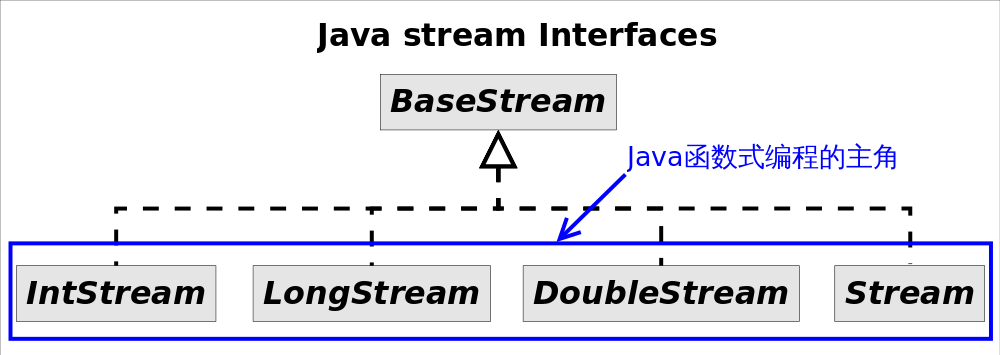
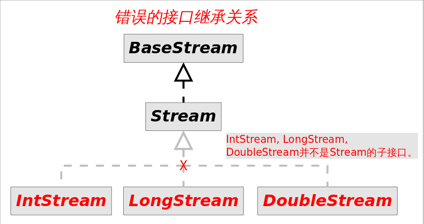
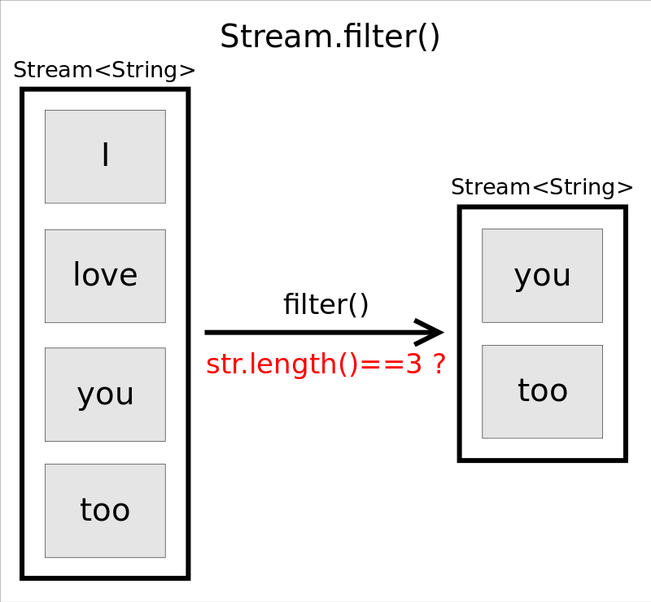
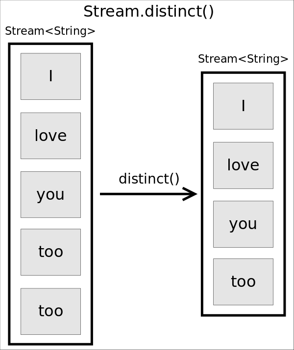
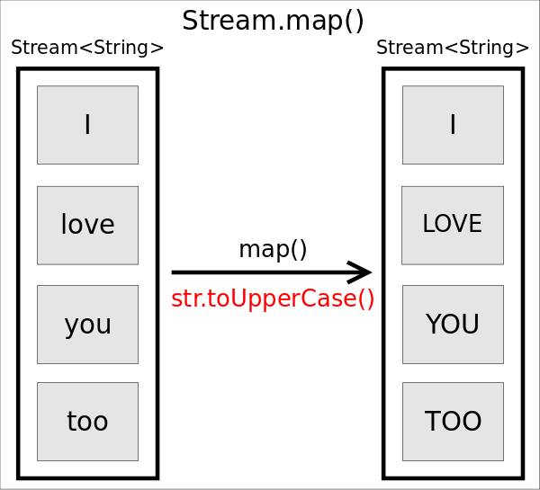
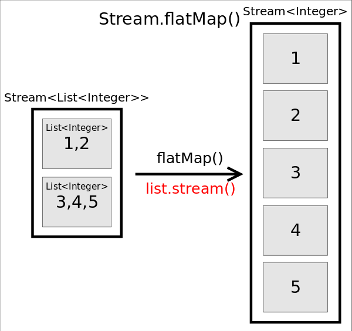

# Streams API(I)

你可能没意识到Java对函数式编程的重视程度，看看Java 8加入函数式编程扩充多少功能就清楚了。Java 8之所以费这么大功夫引入函数式编程，原因有二：

1. **代码简洁**函数式编程写出的代码简洁且意图明确，使用*stream*接口让你从此告别*for*循环。
2. **多核友好**，Java函数式编程使得编写并行程序从未如此简单，你需要的全部就是调用一下`parallel()`方法。

这一节我们学习*stream*，也就是Java函数式编程的主角。对于Java 7来说*stream*完全是个陌生东西，*stream*并不是某种数据结构，它只是数据源的一种视图。这里的数据源可以是一个数组，Java容器或I/O channel等。正因如此要得到一个*stream*通常不会手动创建，而是调用对应的工具方法，比如：

- 调用`Collection.stream()`或者`Collection.parallelStream()`方法
- 调用`Arrays.stream(T[] array)`方法

常见的*stream*接口继承关系如图：



图中4种*stream*接口继承自`BaseStream`，其中`IntStream, LongStream, DoubleStream`对应三种基本类型（`int, long, double`，注意不是包装类型），`Stream`对应所有剩余类型的*stream*视图。为不同数据类型设置不同*stream*接口，可以1.提高性能，2.增加特定接口函数。

<br>



你可能会奇怪为什么不把`IntStream`等设计成`Stream`的子接口？毕竟这接口中的方法名大部分是一样的。答案是这些方法的名字虽然相同，但是返回类型不同，如果设计成父子接口关系，这些方法将不能共存，因为Java不允许只有返回类型不同的方法重载。

虽然大部分情况下*stream*是容器调用`Collection.stream()`方法得到的，但*stream*和*collections*有以下不同：

- **无存储**。*stream*不是一种数据结构，它只是某种数据源的一个视图，数据源可以是一个数组，Java容器或I/O channel等。
- **为函数式编程而生**。对*stream*的任何修改都不会修改背后的数据源，比如对*stream*执行过滤操作并不会删除被过滤的元素，而是会产生一个不包含被过滤元素的新*stream*。
- **惰式执行**。*stream*上的操作并不会立即执行，只有等到用户真正需要结果的时候才会执行。
- **可消费性**。*stream*只能被“消费”一次，一旦遍历过就会失效，就像容器的迭代器那样，想要再次遍历必须重新生成。

对*stream*的操作分为为两类，**中间操作(*intermediate operations*)和结束操作(*terminal operations*)**，二者特点是：

1. __中间操作总是会惰式执行__，调用中间操作只会生成一个标记了该操作的新*stream*，仅此而已。
2. __结束操作会触发实际计算__，计算发生时会把所有中间操作积攒的操作以*pipeline*的方式执行，这样可以减少迭代次数。计算完成之后*stream*就会失效。

如果你熟悉Apache Spark RDD，对*stream*的这个特点应该不陌生。

下表汇总了`Stream`接口的部分常见方法：

|操作类型|接口方法|
|--------|--------|
|中间操作|concat() distinct() filter() flatMap() limit() map() peek() <br> skip() sorted() parallel() sequential() unordered()|
|结束操作|allMatch() anyMatch() collect() count() findAny() findFirst() <br> forEach() forEachOrdered() max() min() noneMatch() reduce() toArray()|

区分中间操作和结束操作最简单的方法，就是看方法的返回值，返回值为*stream*的大都是中间操作，否则是结束操作。

## stream方法使用

*stream*跟函数接口关系非常紧密，没有函数接口*stream*就无法工作。回顾一下：__函数接口是指内部只有一个抽象方法的接口__。通常函数接口出现的地方都可以使用Lambda表达式，所以不必记忆函数接口的名字。

### forEach()

我们对`forEach()`方法并不陌生，在`Collection`中我们已经见过。方法签名为`void forEach(Consumer<? super E> action)`，作用是对容器中的每个元素执行`action`指定的动作，也就是对元素进行遍历。

```Java
// 使用Stream.forEach()迭代
Stream<String> stream = Stream.of("I", "love", "you", "too");
stream.forEach(str -> System.out.println(str));
```
由于`forEach()`是结束方法，上述代码会立即执行，输出所有字符串。

### filter()


函数原型为`Stream<T> filter(Predicate<? super T> predicate)`，作用是返回一个只包含满足`predicate`条件元素的`Stream`。

```Java
// 保留长度等于3的字符串
Stream<String> stream= Stream.of("I", "love", "you", "too");
stream.filter(str -> str.length()==3)
    .forEach(str -> System.out.println(str));
```

上述代码将输出为长度等于3的字符串`you`和`too`。注意，由于`filter()`是个中间操作，如果只调用`filter()`不会有实际计算，因此也不会输出任何信息。

### distinct()



函数原型为`Stream<T> distinct()`，作用是返回一个去除重复元素之后的`Stream`。

```Java
Stream<String> stream= Stream.of("I", "love", "you", "too", "too");
stream.distinct()
    .forEach(str -> System.out.println(str));
```

上述代码会输出去掉一个`too`之后的其余字符串。

<br><br>

### sorted()

排序函数有两个，一个是用自然顺序排序，一个是使用自定义比较器排序，函数原型分别为`Stream<T>　sorted()`和`Stream<T>　sorted(Comparator<? super T> comparator)`。

```Java
Stream<String> stream= Stream.of("I", "love", "you", "too");
stream.sorted((str1, str2) -> str1.length()-str2.length())
    .forEach(str -> System.out.println(str));
```

上述代码将输出按照长度升序排序后的字符串，结果完全在预料之中。

### map()



函数原型为`<R> Stream<R> map(Function<? super T,? extends R> mapper)`，作用是返回一个对当前所有元素执行执行`mapper`之后的结果组成的`Stream`。直观的说，就是对每个元素按照某种操作进行转换，转换前后`Stream`中元素的个数不会改变，但元素的类型取决于转换之后的类型。

```Java
Stream<String> stream　= Stream.of("I", "love", "you", "too");
stream.map(str -> str.toUpperCase())
    .forEach(str -> System.out.println(str));
```
上述代码将输出原字符串的大写形式。

### flatMap()



函数原型为`<R> Stream<R> flatMap(Function<? super T,? extends Stream<? extends R>> mapper)`，作用是对每个元素执行`mapper`指定的操作，并用所有`mapper`返回的`Stream`中的元素组成一个新的`Stream`作为最终返回结果。说起来太拗口，通俗的讲`flatMap()`的作用就相当于把原*stream*中的所有元素都"摊平"之后组成的`Stream`，转换前后元素的个数和类型都可能会改变。

```Java
Stream<List<Integer>> stream = Stream.of(Arrays.asList(1,2), Arrays.asList(3, 4, 5));
stream.flatMap(list -> list.stream())
    .forEach(i -> System.out.println(i));
```

上述代码中，原来的`stream`中有两个元素，分别是两个`List<Integer>`，执行`flatMap()`之后，将每个`List`都“摊平”成了一个个的数字，所以会新产生一个由5个数字组成的`Stream`。所以最终将输出1~5这5个数字。

## 结语

截止到目前我们感觉良好，已介绍`Stream`接口函数理解起来并不费劲儿。如果你就此以为函数式编程不过如此，恐怕是高兴地太早了。下一节对`Stream`规约操作的介绍将刷新你现在的认识。


