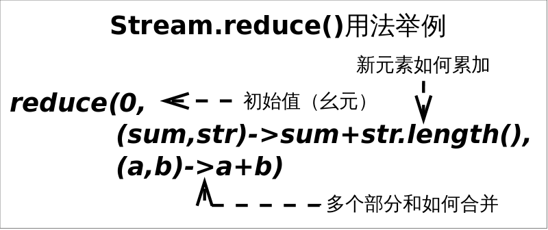
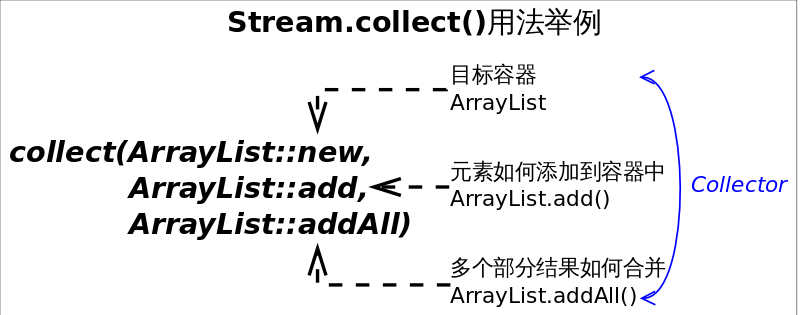

# Streams API(II)

上一节介绍了部分*Stream*常见接口方法，理解起来并不困难，但*Stream*的用法不止于此，本节我们将仍然以*Stream*为例，介绍流的规约操作。

规约操作（*reduction operation*）又被称作折叠操作（*fold*），是通过某个连接动作将所有元素汇总成一个汇总结果的过程。元素求和、求最大值或最小值、求出元素总个数、将所有元素转换成一个列表或集合，都属于规约操作。*Stream*类库有两个通用的规约操作`reduce()`和`collect()`，也有一些为简化书写而设计的专用规约操作，比如`sum()`、`max()`、`min()`、`count()`等。

最大或最小值这类规约操作很好理解（至少方法语义上是这样），我们着重介绍`reduce()`和`collect()`，这是比较有魔法的地方。

## 多面手reduce()

*reduce*操作可以实现从一组元素中生成一个值，`sum()`、`max()`、`min()`、`count()`等都是*reduce*操作，将他们单独设为函数只是因为常用。`reduce()`的方法定义有三种重写形式：

- `Optional<T> reduce(BinaryOperator<T> accumulator)`
- `T reduce(T identity, BinaryOperator<T> accumulator)`
- `<U> U reduce(U identity, BiFunction<U,? super T,U> accumulator, BinaryOperator<U> combiner)`

虽然函数定义越来越长，但语义不曾改变，多的参数只是为了指明初始值（参数*identity*），或者是指定并行执行时多个部分结果的合并方式（参数*combiner*）。`reduce()`最常用的场景就是从一堆值中生成一个值。用这么复杂的函数去求一个最大或最小值，你是不是觉得设计者有病。其实不然，因为“大”和“小”或者“求和"有时会有不同的语义。

需求：*从一组单词中找出最长的单词*。这里“大”的含义就是“长”。
```Java
// 找出最长的单词
Stream<String> stream = Stream.of("I", "love", "you", "too");
Optional<String> longest = stream.reduce((s1, s2) -> s1.length()>=s2.length() ? s1 : s2);
//Optional<String> longest = stream.max((s1, s2) -> s1.length()-s2.length());
System.out.println(longest.get());
```
上述代码会选出最长的单词*love*，其中*Optional*是（一个）值的容器，使用它可以避免*null*值的麻烦。当然可以使用`Stream.max(Comparator<? super T> comparator)`方法来达到同等效果，但`reduce()`自有其存在的理由。



需求：*求出一组单词的长度之和*。这是个“求和”操作，操作对象输入类型是*String*，而结果类型是*Integer*。
```Java
// 求单词长度之和
Stream<String> stream = Stream.of("I", "love", "you", "too");
Integer lengthSum = stream.reduce(0,　// 初始值　// (1)
        (sum, str) -> sum+str.length(), // 累加器 // (2)
        (a, b) -> a+b);　// 部分和拼接器，并行执行时才会用到 // (3)
// int lengthSum = stream.mapToInt(str -> str.length()).sum();
System.out.println(lengthSum);
```
上述代码标号(2)处将i. 字符串映射成长度，ii. 并和当前累加和相加。这显然是两步操作，使用`reduce()`函数将这两步合二为一，更有助于提升性能。如果想要使用`map()`和`sum()`组合来达到上述目的，也是可以的。

`reduce()`擅长的是生成一个值，如果想要从*Stream*生成一个集合或者*Map*等复杂的对象该怎么办呢？终极武器`collect()`横空出世！

## >>> 终极武器collect() <<<

不夸张的讲，如果你发现某个功能在*Stream*接口中没找到，十有八九可以通过`collect()`方法实现。`collect()`是*Stream*接口方法中最灵活的一个，学会它才算真正入门Java函数式编程。先看几个热身的小例子：
```Java
// 将Stream转换成容器或Map
Stream<String> stream = Stream.of("I", "love", "you", "too");
List<String> list = stream.collect(Collectors.toList()); // (1)
// Set<String> set = stream.collect(Collectors.toSet()); // (2)
// Map<String, Integer> map = stream.collect(Collectors.toMap(Function.identity(), String::length)); // (3)
```
上述代码分别列举了如何将*Stream*转换成*List*、*Set*和*Map*。虽然代码语义很明确，可是我们仍然会有几个疑问：

1. `Function.identity()`是干什么的？
2. `String::length`是什么意思？
3. *Collectors*是个什么东西？

## 接口的静态方法和默认方法

*Function*是一个接口，那么`Function.identity()`是什么意思呢？这要从两方面解释：

1. Java 8允许在接口中加入具体方法。接口中的具体方法有两种，*default*方法和*static*方法，`identity()`就是*Function*接口的一个静态方法。
2. `Function.identity()`返回一个输出跟输入一样的Lambda表达式对象，等价于形如`t -> t`形式的Lambda表达式。

上面的解释是不是让你疑问更多？不要问我为什么接口中可以有具体方法，也不要告诉我你觉得`t -> t`比`identity()`方法更直观。我会告诉你接口中的*default*方法是一个无奈之举，在Java 7及之前要想在定义好的接口中加入新的抽象方法是很困难甚至不可能的，因为所有实现了该接口的类都要重新实现。试想在*Collection*接口中加入一个`stream()`抽象方法会怎样？*default*方法就是用来解决这个尴尬问题的，直接在接口中实现新加入的方法。既然已经引入了*default*方法，为何不再加入*static*方法来避免专门的工具类呢！

## 方法引用

诸如`String::length`的语法形式叫做方法引用（*method references*），这种语法用来替代某些特定形式Lambda表达式。如果Lambda表达式的全部内容就是调用一个已有的方法，那么可以用方法引用来替代Lambda表达式。方法引用可以细分为四类：

| 方法引用类别 | 举例 |
|--------|--------|
| 引用静态方法 | `Integer::sum` |
| 引用某个对象的方法 | `list::add` |
| 引用某个类的方法 | `String::length` |
| 引用构造方法 | `HashMap::new` |

我们会在后面的例子中使用方法引用。

## 收集器

相信前面繁琐的内容已彻底打消了你学习Java函数式编程的热情，不过很遗憾，下面的内容更繁琐。但这不能怪Stream类库，因为要实现的功能本身很复杂。



收集器（*Collector*）是为`Stream.collect()`方法量身打造的工具接口（类）。考虑一下将一个*Stream*转换成一个容器（或者*Map*）需要做哪些工作？我们至少需要两样东西：

1. 目标容器是什么？是*ArrayList*还是*HashSet*，或者是个*TreeMap*。
2. 新元素如何添加到容器中？是`List.add()`还是`Map.put()`。

如果并行的进行规约，还需要告诉*collect()* 3. 多个部分结果如何合并成一个。

结合以上分析，*collect()*方法定义为`<R> R collect(Supplier<R> supplier, BiConsumer<R,? super T> accumulator, BiConsumer<R,R> combiner)`，三个参数依次对应上述三条分析。不过每次调用*collect()*都要传入这三个参数太麻烦，收集器*Collector*就是对这三个参数的简单封装,所以*collect()*的另一定义为`<R,A> R collect(Collector<? super T,A,R> collector)`。*Collectors*工具类可通过静态方法生成各种常用的*Collector*。举例来说，如果要将*Stream*规约成*List*可以通过如下两种方式实现：
```Java
//　将Stream规约成List
Stream<String> stream = Stream.of("I", "love", "you", "too");
List<String> list = stream.collect(ArrayList::new, ArrayList::add, ArrayList::addAll);// 方式１
//List<String> list = stream.collect(Collectors.toList());// 方式2
System.out.println(list);
```
通常情况下我们不需要手动指定*collect()*的三个参数，而是调用`collect(Collector<? super T,A,R> collector)`方法，并且参数中的*Collector*对象大都是直接通过*Collectors*工具类获得。实际上传入的**收集器的行为决定了`collect()`的行为**。

## 使用collect()生成Collection

前面已经提到通过`collect()`方法将*Stream*转换成容器的方法，这里再汇总一下。将*Stream*转换成*List*或*Set*是比较常见的操作，所以*Collectors*工具已经为我们提供了对应的收集器，通过如下代码即可完成：
```Java
// 将Stream转换成List或Set
Stream<String> stream = Stream.of("I", "love", "you", "too");
List<String> list = stream.collect(Collectors.toList()); // (1)
Set<String> set = stream.collect(Collectors.toSet()); // (2)
```
上述代码能够满足大部分需求，但由于返回结果是接口类型，我们并不知道类库实际选择的容器类型是什么，有时候我们可能会想要人为指定容器的实际类型，这个需求可通过`Collectors.toCollection(Supplier<C> collectionFactory)`方法完成。
```Java
// 使用toCollection()指定规约容器的类型
ArrayList<String> arrayList = stream.collect(Collectors.toCollection(ArrayList::new));// (3)
HashSet<String> hashSet = stream.collect(Collectors.toCollection(HashSet::new));// (4)
```
上述代码(3)处指定规约结果是*ArrayList*，而(4)处指定规约结果为*HashSet*。一切如你所愿。

## 使用collect()生成Map

前面已经说过*Stream*背后依赖于某种数据源，数据源可以是数组、容器等，但不能是*Map*。反过来从*Stream*生成*Map*是可以的，但我们要想清楚*Map*的*key*和*value*分别代表什么，根本原因是我们要想清楚要干什么。通常在三种情况下`collect()`的结果会是*Map*：

1. 使用`Collectors.toMap()`生成的收集器，用户需要指定如何生成*Map*的*key*和*value*。
2. 使用`Collectors.partitioningBy()`生成的收集器，对元素进行二分区操作时用到。
3. 使用`Collectors.groupingBy()`生成的收集器，对元素做*group*操作时用到。

情况1：使用`toMap()`生成的收集器，这种情况是最直接的，前面例子中已提到，这是和`Collectors.toCollection()`并列的方法。如下代码展示将学生列表转换成由<学生，GPA>组成的*Map*。非常直观，无需多言。
```Java
// 使用toMap()统计学生GPA
Map<Student, Double> studentToGPA =
     students.stream().collect(Collectors.toMap(Functions.identity(),// 如何生成key
                                     student -> computeGPA(student)));// 如何生成value
```
情况2：使用`partitioningBy()`生成的收集器，这种情况适用于将`Stream`中的元素依据某个二值逻辑（满足条件，或不满足）分成互补相交的两部分，比如男女性别、成绩及格与否等。下列代码展示将学生分成成绩及格或不及格的两部分。
```Java
// Partition students into passing and failing
Map<Boolean, List<Student>> passingFailing = students.stream()
         .collect(Collectors.partitioningBy(s -> s.getGrade() >= PASS_THRESHOLD));
```
情况3：使用`groupingBy()`生成的收集器，这是比较灵活的一种情况。跟SQL中的*group by*语句类似，这里的*groupingBy()*也是按照某个属性对数据进行分组，属性相同的元素会被对应到*Map*的同一个*key*上。下列代码展示将员工按照部门进行分组：
```Java
// Group employees by department
Map<Department, List<Employee>> byDept = employees.stream()
            .collect(Collectors.groupingBy(Employee::getDepartment));
```
以上只是分组的最基本用法，有些时候仅仅分组是不够的。在SQL中使用*group by*是为了协助其他查询，比如*1. 先将员工按照部门分组，2. 然后统计每个部门员工的人数*。Java类库设计者也考虑到了这种情况，增强版的`groupingBy()`能够满足这种需求。增强版的`groupingBy()`允许我们对元素分组之后再执行某种运算，比如求和、计数、平均值、类型转换等。这种先将元素分组的收集器叫做**上游收集器**，之后执行其他运算的收集器叫做**下游收集器**(*downstream Collector*)。
```Java
// 使用下游收集器统计每个部门的人数
Map<Department, Integer> totalByDept = employees.stream()
                    .collect(Collectors.groupingBy(Employee::getDepartment,
                                                   Collectors.counting()));// 下游收集器
```
上面代码的逻辑是不是越看越像SQL？高度非结构化。还有更狠的，下游收集器还可以包含更下游的收集器，这绝不是为了炫技而增加的把戏，而是实际场景需要。考虑将员工按照部门分组的场景，如果*我们想得到每个员工的名字（字符串），而不是一个个*Employee*对象*，可通过如下方式做到：
```Java
// 按照部门对员工分布组，并只保留员工的名字
Map<Department, List<String>> byDept = employees.stream()
                .collect(Collectors.groupingBy(Employee::getDepartment,
                        Collectors.mapping(Employee::getName,// 下游收集器
                                Collectors.toList())));// 更下游的收集器
```
如果看到这里你还没有对Java函数式编程失去信心，恭喜你，你已经顺利成为Java函数式编程大师了。

## 使用collect()做字符串join

这个肯定是大家喜闻乐见的功能，字符串拼接时使用`Collectors.joining()`生成的收集器，从此告别*for*循环。`Collectors.joining()`方法有三种重写形式，分别对应三种不同的拼接方式。无需多言，代码过目难忘。
```Java
// 使用Collectors.joining()拼接字符串
Stream<String> stream = Stream.of("I", "love", "you");
//String joined = stream.collect(Collectors.joining());// "Iloveyou"
//String joined = stream.collect(Collectors.joining(","));// "I,love,you"
String joined = stream.collect(Collectors.joining(",", "{", "}"));// "{I,love,you}"
```
## collect()还可以做更多

除了可以使用*Collectors*工具类已经封装好的收集器，我们还可以自定义收集器，或者直接调用`collect(Supplier<R> supplier, BiConsumer<R,? super T> accumulator, BiConsumer<R,R> combiner)`方法，**收集任何形式你想要的信息**。不过*Collectors*工具类应该能满足我们的绝大部分需求，手动实现之间请先看看文档。

# 参考文献

1. https://docs.oracle.com/javase/8/docs/api/java/util/stream/package-summary.html#package.description
2. https://docs.oracle.com/javase/tutorial/java/javaOO/methodreferences.html
3. https://docs.oracle.com/javase/8/docs/api/java/util/stream/Collector.html
4. https://docs.oracle.com/javase/8/docs/api/java/util/stream/Stream.html
5. https://docs.oracle.com/javase/8/docs/api/java/util/stream/Collectors.html


