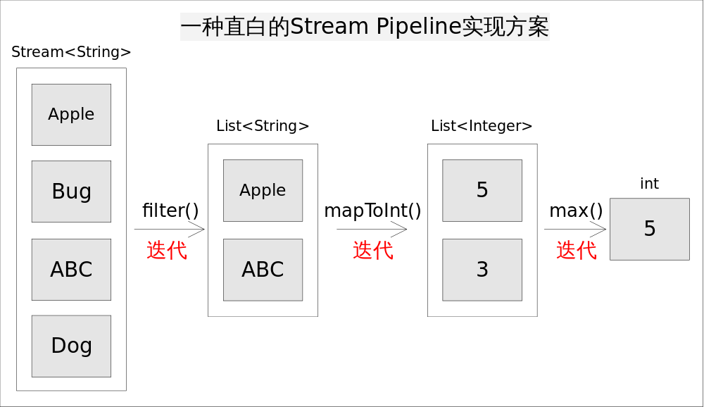
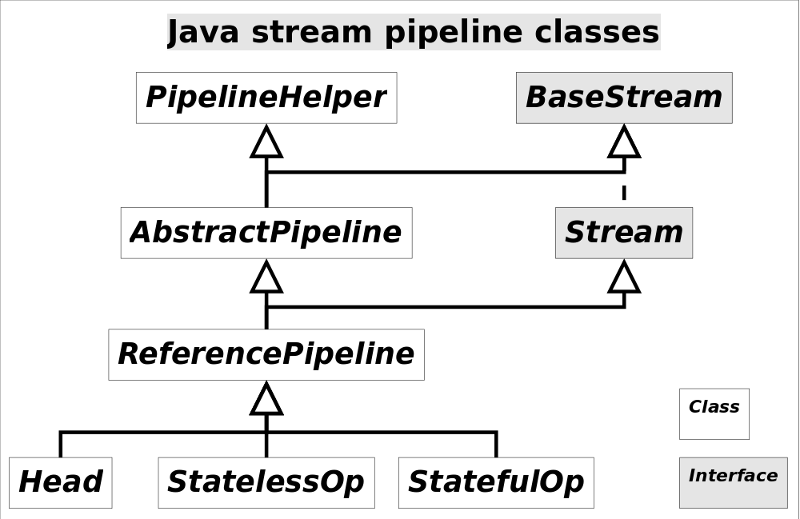
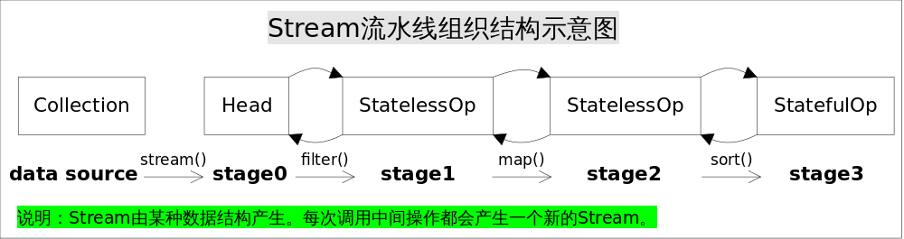

# Stream Pipelines

前面我们已经学会如何使用Stream API，用起来真的很爽，但简洁的方法下面似乎隐藏着无尽的秘密，如此强大的API是如何实现的呢？比如Pipeline是怎么执行的，每次方法调用都会导致一次迭代吗？自动并行又是怎么做到的，线程个数是多少？本节我们学习Stream流水线的原理，这是Stream实现的关键所在。

首先回顾一下容器执行Lambda表达式的方式，以`ArrayList.forEach()`方法为例，具体代码如下：

```Java
// ArrayList.forEach()
public void forEach(Consumer<? super E> action) {
    ...
    for (int i=0; modCount == expectedModCount && i < size; i++) {
        action.accept(elementData[i]);// 回调方法
    }
    ...
}
```

我们看到`ArrayList.forEach()`方法的主要逻辑就是一个*for*循环，在该*for*循环里不断调用`action.accept()`回调方法完成对元素的遍历。这完全没有什么新奇之处，回调方法在Java GUI的监听器中广泛使用。Lambda表达式的作用就是相当于一个回调方法，这很好理解。

Stream API中大量使用Lambda表达式作为回调方法，但这并不是关键。理解Stream我们更关心的是另外两个问题：流水线和自动并行。使用Stream或许很容易写入如下形式的代码：

```Java
int longestStringLengthStartingWithA
        = strings.stream()
              .filter(s -> s.startsWith("A"))
              .mapToInt(String::length)
              .max();
```

上述代码求出以字母*A*开头的字符串的最大长度，一种直白的方式是为每一次函数调用都执一次迭代，这样做能够实现功能，但效率上肯定是无法接受的。类库的实现着使用流水线（*Pipeline*）的方式巧妙的避免了多次迭代，其基本思想是在一次迭代中尽可能多的执行用户指定的操作。为讲解方便我们汇总了Stream的所有操作。

<table align="center"><tr><td colspan="3" align="center"  border="0">Stream操作分类</td></tr><tr><td rowspan="2"  border="1">中间操作(Intermediate operations)</td><td>无状态(Stateless)</td><td>unordered() filter() map() mapToInt() mapToLong() mapToDouble() flatMap() flatMapToInt() flatMapToLong() flatMapToDouble() peek()</td></tr><tr><td>有状态(Stateful)</td><td>distinct() sorted() sorted() limit() skip() </td></tr><tr><td rowspan="2"  border="1">结束操作(Terminal operations)</td><td>非短路操作</td><td>forEach() forEachOrdered() toArray() reduce() collect() max() min() count() allMatch() noneMatch() </td></tr><tr><td>短路操作(short-circuiting)</td><td>anyMatch() findFirst() findAny() </td></tr></table>

Stream上的所有操作分为两类：中间操作和结束操作，中间操作只是一种标记，只有结束操作才会触发实际计算。中间操作又可以分为无状态的(*Stateless*)和有状态的(*Stateful*)，无状态中间操作是指元素的处理不受前面元素的影响，而有状态的中间操作必须等到所有元素处理之后才知道最终结果，比如排序操作，在读取所有元素之前并不能确定排序结果；结束操作又可以分为短路操作和非短路操作，短路操作是指不用处理全部元素就可以得到结果，比如*找到第一个满足条件的元素*。之所以要进行如此精细的划分，是因为底层对每一种情况的处理方式不同。

## 一种直白的实现方式

仍然考虑上述求最长字符串的程序，一种直白的方式是为每一次函数调用都执一次迭代，并将处理中间结果放到某种数据结构中（比如数组，容器等）。具体说来，就是调用*filter()*方法后立即执行，选出所有以*A*开头的字符串并放到一个列表list1中，之后让list1传递给*mapToInt()*方法并立即执行，生成的结果放到list2中，最后遍历list2找出最大的数字作为最终结果。程序的执行流程如下如所示：



<br>

这样做实现起来非常简单直观，但有两个明显的弊端：

1. 迭代次数多。迭代次数跟函数调用的次数相等。
2. 频繁产生中间结果。每次函数调用都产生一次中间结果，存储开销无法接受。

这种弊端使得效率地下，根本无法接受。如果不使用Stream API我们都知道上述代码该如何在一次迭代中完成，大致是如下形式：

```Java
int longest = 0;
for(String str : strings){
    if(str.startsWith("A")){// 1. filter(), 保留以A开头的字符串
        int len = str.length();// 2. mapToInt(), 转换成长度
        longest = Math.max(len, longest);// 3. max(), 保留最长的长度
    }
}
```

采用这种方式我们不但减少了迭代次数，也避免了存储中间结果，显然这就是流水线，因为我们把三个操作放在了一次迭代当中。只要我们事先知道用户意图，总是能够采用上述方式实现跟Stream API等价的功能，但问题是Stream类库的设计者并不知道用户的意图是什么。如何在无法假设用户行为的前提下实现流水线，是类库的设计者要考虑的问题。

## Stream流水线解决方案

我们大致能够想到，应该采用某种方式记录用户每一步的操作，当用户调用结束操作时将之前记录的操作叠加到一起在一次迭代中全部执行掉。沿着这个思路，有几个问题需要解决：

1. 用户的操作如何记录？
2. 操作如何叠加？
3. 叠加之后的操作如何执行？

### >> 操作如何记录

注意这里使用的是*“操作(operation)”*一词，指的是“Stream中间操作”的操作，很多Stream操作会需要一个回调函数（Lambda表达式），因此一个完整的操作是*<数据来源，操作，回调函数>*构成的三元组。Stream中使用Stage的概念来描述一个完整的操作，并用某种实例化后的*PipelineHelper*来代表Stage，将具有先后顺序的各个Stage连到一起，就构成了整个流水线。跟Stream相关类和接口的继承关系如下：



图中还有*IntPipeline*, *LongPipeline*, *DoublePipeline*没有画出，这三个类专门为三种基本类型（不是包装类型）而定制的，跟*ReferencePipeline*是并列关系。图中*Head*用于表示第一个Stage，即调用调用诸如*Collection.stream()*方法产生的Stage，很显然这个Stage里不包含任何操作；*StatelessOp*和*StatefulOp*分别表示有状态和无状态的Stage，对应与有状态和无状态的中间操作。

<br>

一个可能的流水线示意图如下：



<br>

图中通过*Collection.stream()*方法得到*Head*也就是stage0，紧接着调用一系列的中间操作，不断产生新的Stream。**这些Stream对象以双向链表的形式组织在一起，构成整个流水线，由于每个Stage都记录了前一个Stage和本次的操作以及回调函数，依靠这种结构就能建立起对数据源的所有操作**。这就是Stream记录操作的方式。

### >> 操作如何叠加

以上只是解决了操作记录的问题，要想让流水线起到应有的作用我们需要一种将所有操作叠加到一起的方案。你可能会觉得这很简单，只需要从流水线的head开始依次执行每一步的操作（包括回调函数）就行了。这听起来似乎是可行的，但是你忽略了前面的Stage并不知道后面Stage到底执行了哪种操作，以及回调函数是哪种形式。换句话说，只有当前Stage本身才知道该如何执行自己包含的动作。这就需要有某种协议来协调相邻Stage之间的调用关系。

这种协议由*Sink*接口完成，*Sink*接口包含的方法如下表所示：

<table><tr><td>方法名</td><td>作用</td></tr><tr><td>void begin(long size)</td><td>开始遍历元素之前调用该方法，通知Sink做好准备。</td></tr><tr><td>void end()</td><td>所有元素遍历完成之后调用，通知Sink没有更多的元素了。</td></tr><tr><td>boolean cancellationRequested()</td><td>是否可以结束操作，可以让短路操作尽早结束。</td></tr><tr><td>void accept(T t)</td><td>接受一个待处理元素，并对元素进行处理。Stage把自己包含的操作和回调方法封装到该方法里，前一个Stage只需要调用当前Stage.accept(T t)方法就行了</td></tr></table>

有了上面的协议，相邻Stage之间调用就很方便了，每个Stage都会将自己的操作封装到一个Sink里，前一个Stage只需调用后一个Stage的*accept()*方法即可，并不需要知道其内部是如何处理的。当然对于有状态的操作，Sink的*begin()*和*end()*方法也是必须实现的。比如Stream.sorted()是一个有状态的中间操作，其对应的*Sink.begin()*方法可能创建一个乘放结果的容器，而*accept()*方法负责将元素添加到该容器，最后*end()*负责对容器进行排序。对于短路操作，*Sink.cancellationRequested()*也是必须实现的，比如*Stream.findFirst()*是短路操作，只要找到一个元素，*cancellationRequested()*就应该返回*true*，以便调用者尽快结束查找。Sink的四个接口方法常常相互协作，共同完成计算任务。

有了Sink对操作的包装，Stage之间的调用问题就解决了，执行时只需要从流水线的head开始依次调用每个Stage对应的*{Sink.begin(), accept(), cancellationRequested(), end()}*方法就可以了。一种可能的*Sink.accept()*方法流程是这样的：

```Java
void accept(U u){
	1. 使用当前Sink包装的回调函数处理u
    2. 将处理结果传递给流水线下游的Sink
}
```


