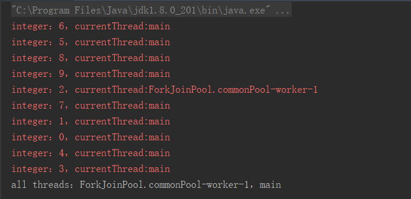
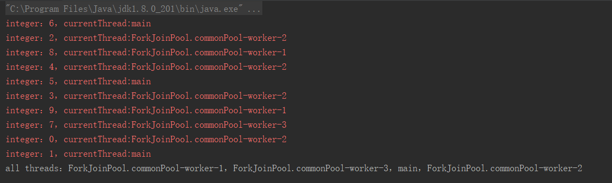
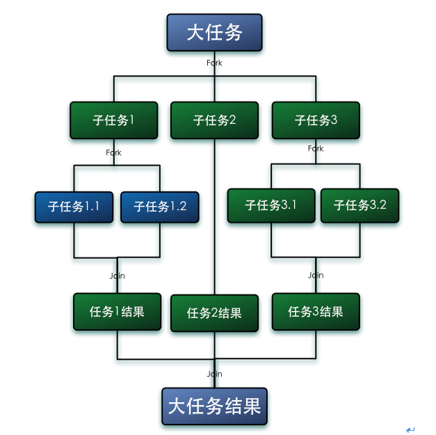
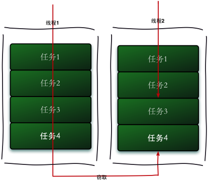

# parallelStream 介绍

## 引言
大家应该已经对Stream有过很多的了解，对其原理及常见使用方法已经也有了一定的认识。流在处理数据进行一些迭代操作的时候确认很方便，但是在执行一些耗时或是占用资源很高的任务时候，串行化的流无法带来速度/性能上的提升，并不能满足我们的需要，通常我们会使用多线程来并行或是分片分解执行任务，而在Stream中也提供了这样的并行方法，那就是使用parallelStream()方法或者是使用stream().parallel()来转化为并行流。开箱即用的并行流的使用看起来如此简单，然后我们就可能会忍不住思考，并行流的实现原理是怎样的？它的使用会给我们带来多大的性能提升？我们可以在什么场景下使用以及使用时应该注意些什么？

首先我们看一下Java 的并行 API 演变历程基本如下：
- 1.0-1.4 中的 java.lang.Thread
- 5.0 中的 java.util.concurrent
- 6.0 中的 Phasers 等
- 7.0 中的 Fork/Join 框架
- 8.0 中的 Lambda

## parallelStream是什么？
先看一下`Collection`接口提供的并行流方法
```java
/**
 * Returns a possibly parallel {@code Stream} with this collection as its
 * source.  It is allowable for this method to return a sequential stream.
 *
 * <p>This method should be overridden when the {@link #spliterator()}
 * method cannot return a spliterator that is {@code IMMUTABLE},
 * {@code CONCURRENT}, or <em>late-binding</em>. (See {@link #spliterator()}
 * for details.)
 *
 * @implSpec
 * The default implementation creates a parallel {@code Stream} from the
 * collection's {@code Spliterator}.
 *
 * @return a possibly parallel {@code Stream} over the elements in this
 * collection
 * @since 1.8
 */
default Stream<E> parallelStream() {
    return StreamSupport.stream(spliterator(), true);
}
```
注意其中的代码注释的返回值 `@return a possibly parallel` 一句说明调用了这个方法，只是可能会返回一个并行的流，流是否能并行执行还受到其他一些条件的约束。
parallelStream其实就是一个并行执行的流，它通过默认的`ForkJoinPool`，**可能**提高你的多线程任务的速度。
引用[Custom thread pool in Java 8 parallel stream](https://stackoverflow.com/questions/21163108/custom-thread-pool-in-java-8-parallel-stream)上面的两段话：
> The parallel streams use the default `ForkJoinPool.commonPool` which [by default has one less threads as you have processors](http://docs.oracle.com/javase/8/docs/api/java/util/concurrent/ForkJoinPool.html), as returned by `Runtime.getRuntime().availableProcessors()` (This means that parallel streams use all your processors because they also use the main thread)。

做个实验来证明上面这句话的真实性：
```java
public static void main(String[] args) {
    IntStream list = IntStream.range(0, 10);
    Set<Thread> threadSet = new HashSet<>();
    //开始并行执行
    list.parallel().forEach(i -> {
        Thread thread = Thread.currentThread();
        System.err.println("integer：" + i + "，" + "currentThread:" + thread.getName());
        threadSet.add(thread);
    });
    System.out.println("all threads：" + Joiner.on("，").join(threadSet.stream().map(Thread::getName).collect(Collectors.toList())));
}
```


从运行结果里面我们可以很清楚的看到parallelStream同时使用了主线程和`ForkJoinPool.commonPool`创建的线程。
值得说明的是这个运行结果并不是唯一的，实际运行的时候可能会得到多个结果，比如：



甚至你的运行结果里面只有主线程。

来源于java 8 实战的书籍的一段话：
> 并行流内部使用了默认的`ForkJoinPool`（7.2节会进一步讲到分支/合并框架），它默认的线程数量就是你的处理器数量，这个值是由`Runtime.getRuntime().available- Processors()`得到的。 但是你可以通过系统属性`java.util.concurrent.ForkJoinPool.common. parallelism`来改变线程池大小，如下所示： `System.setProperty("java.util.concurrent.ForkJoinPool.common.parallelism","12");` 这是一个全局设置，因此它将影响代码中所有的并行流。反过来说，目前还无法专为某个 并行流指定这个值。一般而言，让`ForkJoinPool`的大小等于处理器数量是个不错的默认值， 除非你有很好的理由，否则我们强烈建议你不要修改它。

```java
// 设置全局并行流并发线程数
System.setProperty("java.util.concurrent.ForkJoinPool.common.parallelism", "12");
System.out.println(ForkJoinPool.getCommonPoolParallelism());// 输出 12
System.setProperty("java.util.concurrent.ForkJoinPool.common.parallelism", "20");
System.out.println(ForkJoinPool.getCommonPoolParallelism());// 输出 12
```
为什么两次的运行结果是一样的呢？上面刚刚说过了这是一个全局设置，`java.util.concurrent.ForkJoinPool.common.parallelism`是final类型的，整个JVM中只允许设置一次。既然默认的并发线程数不能反复修改，那怎么进行不同线程数量的并发测试呢？答案是：`引入ForkJoinPool`
```java
IntStream range = IntStream.range(1, 100000);
// 传入parallelism
new ForkJoinPool(parallelism).submit(() -> range.parallel().forEach(System.out::println)).get();
```
因此，使用parallelStream时需要注意的一点是，**多个parallelStream之间默认使用的是同一个线程池**，所以IO操作尽量不要放进parallelStream中，否则会阻塞其他parallelStream。
> Using a ForkJoinPool and submit for a parallel stream does not reliably use all threads. If you look at this ( [Parallel stream from a HashSet doesn't run in parallel](https://stackoverflow.com/questions/28985704/parallel-stream-from-a-hashset-doesnt-run-in-parallel) ) and this ( [Why does the parallel stream not use all the threads of the ForkJoinPool?](https://stackoverflow.com/questions/36947336/why-does-the-parallel-stream-not-use-all-the-threads-of-the-forkjoinpool) ), you'll see the reasoning.

```java
// 获取当前机器CPU处理器的数量
System.out.println(Runtime.getRuntime().availableProcessors());// 输出 4
// parallelStream默认的并发线程数
System.out.println(ForkJoinPool.getCommonPoolParallelism());// 输出 3
```
为什么parallelStream默认的并发线程数要比CPU处理器的数量少1个？文章的开始已经提过了。因为最优的策略是每个CPU处理器分配一个线程，然而主线程也算一个线程，所以要占一个名额。
这一点可以从源码中看出来：
```java
static final int MAX_CAP      = 0x7fff;        // max #workers - 1
// 无参构造函数
public ForkJoinPool() {
        this(Math.min(MAX_CAP, Runtime.getRuntime().availableProcessors()),
             defaultForkJoinWorkerThreadFactory, null, false);
}bs-channel
```

## 从parallelStream认识[Fork/Join 框架](https://www.infoq.cn/article/fork-join-introduction/)
Fork/Join 框架的核心是采用分治法的思想，将一个大任务拆分为若干互不依赖的子任务，把这些子任务分别放到不同的队列里，并为每个队列创建一个单独的线程来执行队列里的任务。同时，为了最大限度地提高并行处理能力，采用了工作窃取算法来运行任务，也就是说当某个线程处理完自己工作队列中的任务后，尝试当其他线程的工作队列中窃取一个任务来执行，直到所有任务处理完毕。所以为了减少线程之间的竞争，通常会使用双端队列，被窃取任务线程永远从双端队列的头部拿任务执行，而窃取任务的线程永远从双端队列的尾部拿任务执行。
- Fork/Join 的运行流程图


简单地说就是大任务拆分成小任务，分别用不同线程去完成，然后把结果合并后返回。所以第一步是拆分，第二步是分开运算，第三步是合并。这三个步骤分别对应的就是Collector的*supplier*,*accumulator*和*combiner*。
- 工作窃取算法
Fork/Join最核心的地方就是利用了现代硬件设备多核,在一个操作时候会有空闲的CPU,那么如何利用好这个空闲的cpu就成了提高性能的关键,而这里我们要提到的工作窃取（work-stealing）算法就是整个Fork/Join框架的核心理念,工作窃取（work-stealing）算法是指某个线程从其他队列里窃取任务来执行。  


## 使用parallelStream的利弊
使用parallelStream的几个好处：
1) 代码优雅，可以使用lambda表达式，原本几句代码现在一句可以搞定；
2) 运用多核特性(forkAndJoin)并行处理，大幅提高效率。
关于并行流和多线程的性能测试可以看一下下面的几篇博客：  
[并行流适用场景-CPU密集型](https://blog.csdn.net/larva_s/article/details/90403578)    
[提交订单性能优化系列之006-普通的Thread多线程改为Java8的parallelStream并发流](https://blog.csdn.net/blueskybluesoul/article/details/82817007)

然而，任何事物都不是完美的，并行流也不例外，其中最明显的就是使用(parallel)Stream极其不便于代码的跟踪调试，此外并行流带来的不确定性也使得我们对它的使用变得格外谨慎。我们得去了解更多的并行流的相关知识来保证自己能够正确的使用这把双刃剑。

parallelStream使用时需要注意的点：
1) **parallelStream是线程不安全的；**
```java
List<Integer> values = new ArrayList<>();
IntStream.range(1, 10000).parallel().forEach(values::add);
System.out.println(values.size());
```
values集合大小可能不是10000。集合里面可能会存在null元素或者抛出下标越界的异常信息。  
原因：List不是线程安全的集合，add方法在多线程环境下会存在并发问题。
当执行add方法时，会先将此容器的大小增加。。即size++，然后将传进的元素赋值给新增的`elementData[size++]`，即新的内存空间。但是此时如果在size++后直接来取这个List,而没有让add完成赋值操作，则会导致此List的长度加一，，但是最后一个元素是空（null），所以在获取它进行计算的时候报了空指针异常。而下标越界还不能仅仅依靠这个来解释，如果你观察发生越界时的数组下标，分别为10、15、22、33、49和73。结合前面讲的数组自动机制，数组初始长度为10，第一次扩容为15=10+10/2，第二次扩容22=15+15/2，第三次扩容33=22+22/2...以此类推，我们不难发现，越界异常都发生在数组扩容之时。
`grow()`方法解释了基于数组的ArrayList是如何扩容的。数组进行扩容时，会将老数组中的元素重新拷贝一份到新的数组中，通过`oldCapacity + (oldCapacity >> 1)`运算，每次数组容量的增长大约是其原容量的1.5倍。
 ```java
    /**
     * Increases the capacity to ensure that it can hold at least the
     * number of elements specified by the minimum capacity argument.
     *
     * @param minCapacity the desired minimum capacity
     */
    private void grow(int minCapacity) {
        // overflow-conscious code
        int oldCapacity = elementData.length;
        int newCapacity = oldCapacity + (oldCapacity >> 1);// 1.5倍扩容
        if (newCapacity - minCapacity < 0)
            newCapacity = minCapacity;
        if (newCapacity - MAX_ARRAY_SIZE > 0)
            newCapacity = hugeCapacity(minCapacity);
        // minCapacity is usually close to size, so this is a win:
        elementData = Arrays.copyOf(elementData, newCapacity);// 拷贝旧的数组到新的数组中
    }


    /**
     * Appends the specified element to the end of this list.
     *
     * @param e element to be appended to this list
     * @return <tt>true</tt> (as specified by {@link Collection#add})
     */
    public boolean add(E e) {
        ensureCapacityInternal(size + 1);  // Increments modCount!! 检查array容量
        elementData[size++] = e;// 赋值，增大Size的值
        return true;
    }
```
解决方法：
加锁、使用线程安全的集合或者采用`collect()`或者`reduce()`操作就是满足线程安全的了。
```java
List<Integer> values = new ArrayList<>();
for (int i = 0; i < 10000; i++) {
    values.add(i);
}
List<Integer> collect = values.stream().parallel().collect(Collectors.toList());
System.out.println(collect.size());
``` 
2) parallelStream 适用的场景是CPU密集型的，只是做到别浪费CPU，假如本身电脑CPU的负载很大，那还到处用并行流，那并不能起到作用；
- I/O密集型 磁盘I/O、网络I/O都属于I/O操作，这部分操作是较少消耗CPU资源，一般并行流中不适用于I/O密集型的操作，就比如使用并流行进行大批量的消息推送，涉及到了大量I/O，使用并行流反而慢了很多
- CPU密集型 计算类型就属于CPU密集型了，这种操作并行流就能提高运行效率。

3) 不要在多线程中使用parallelStream，原因同上类似，大家都抢着CPU是没有提升效果，反而还会加大线程切换开销；
4) 会带来不确定性，请确保每条处理无状态且没有关联；
5) 考虑NQ模型：N可用的数据量，Q针对每个数据元素执行的计算量，乘积 N * Q 越大，就越有可能获得并行提速。N * Q>10000（大概是集合大小超过1000） 就会获得有效提升；
6) parallelStream是创建一个并行的Stream,而且它的并行操作是*不具备线程传播性*的,所以是无法获取ThreadLocal创建的线程变量的值；
7) **在使用并行流的时候是无法保证元素的顺序的，也就是即使你用了同步集合也只能保证元素都正确但无法保证其中的顺序**；
8) lambda的执行并不是瞬间完成的，所有使用parallel stream的程序都有可能成为阻塞程序的源头，并且在执行过程中程序中的其他部分将无法访问这些workers，这意味着任何依赖parallel streams的程序在什么别的东西占用着common ForkJoinPool时将会变得不可预知并且暗藏危机。