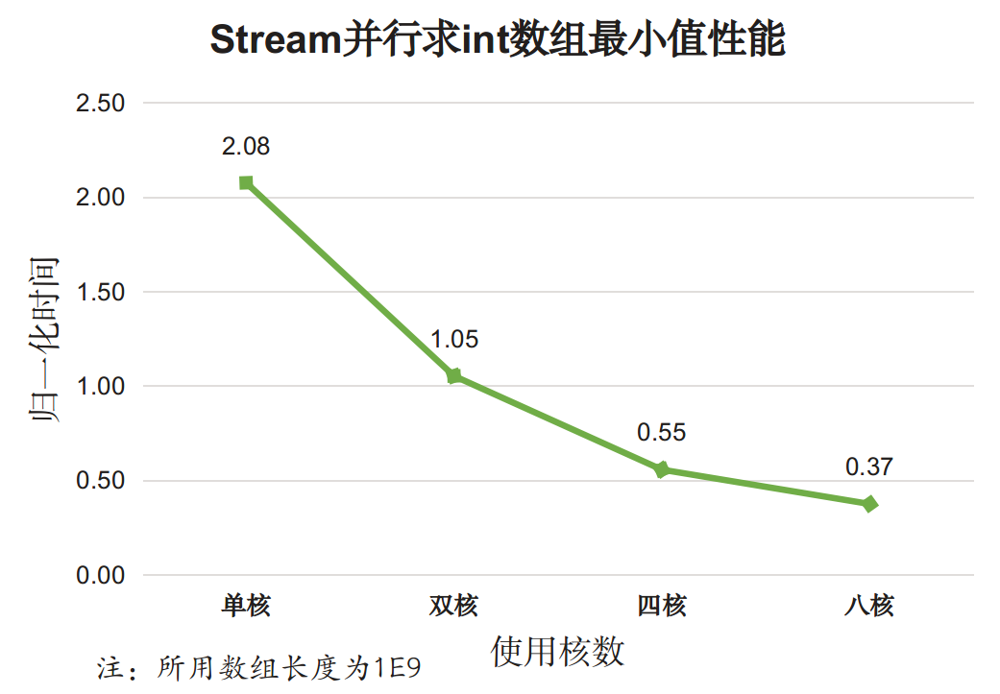
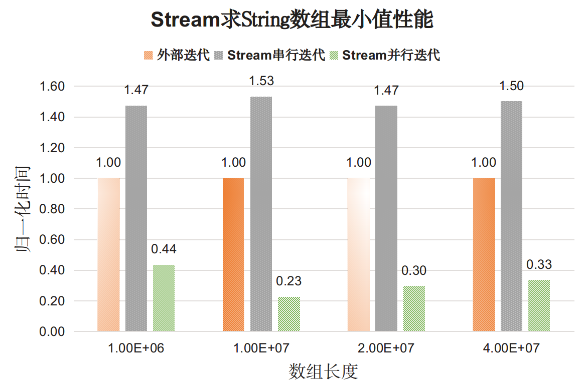
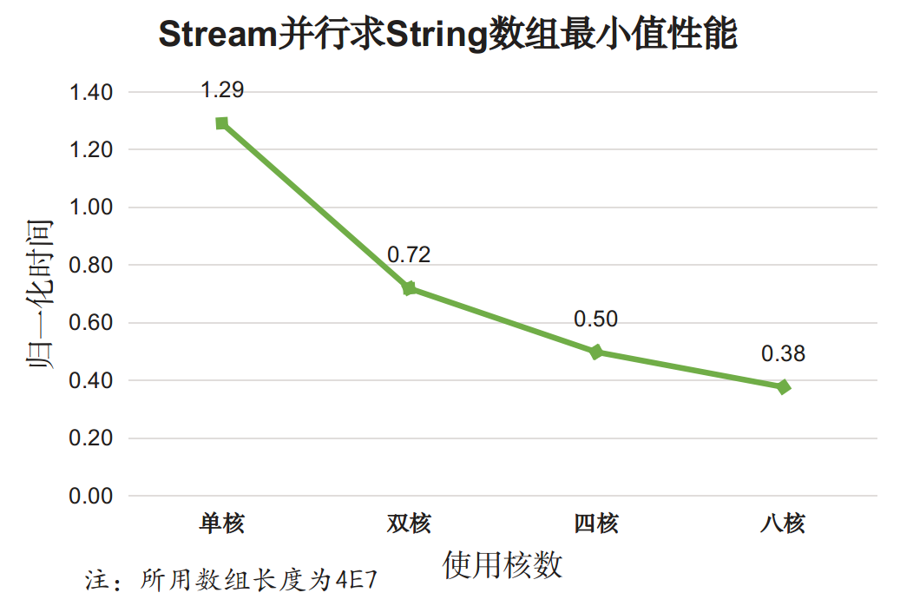
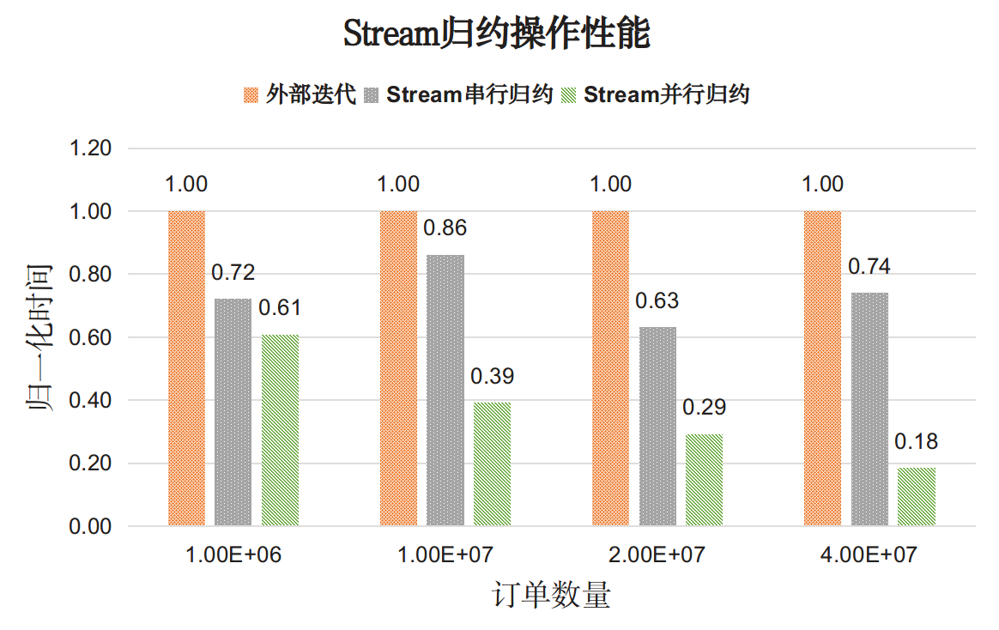
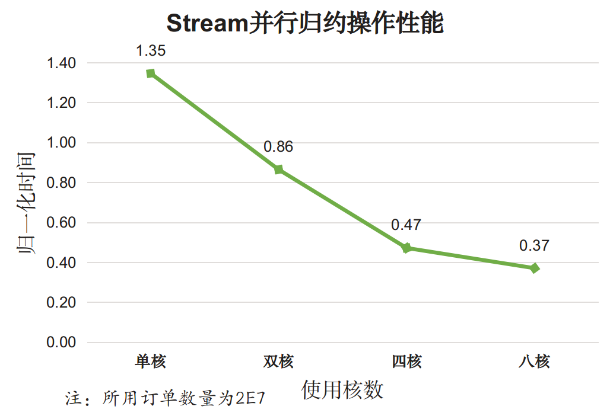

# Stream Performance

已经对Stream API的用法鼓吹够多了，用起简洁直观，但性能到底怎么样呢？会不会有很高的性能损失？本节我们对Stream API的性能一探究竟。

为保证测试结果真实可信，我们将JVM运行在`-server`模式下，测试数据在GB量级，测试机器采用常见的商用服务器，配置如下：

<table width="300px"><tr><td>OS</td><td>CentOS 6.7 x86_64</td></tr><tr><td>CPU</td><td>Intel Xeon X5675, 12M Cache 3.06 GHz, 6 Cores 12 Threads</td></tr><tr><td>内存</td><td>96GB</td></tr><tr><td>JDK</td><td>java version 1.8.0_91, Java HotSpot(TM) 64-Bit Server VM</td></tr></table>

测试[所用代码在这里](./perf/StreamBenchmark/src/lee)，测试[结果汇总](./perf/Stream_performance.xlsx).

## 测试方法和测试数据

性能测试并不是容易的事，Java性能测试更费劲，因为虚拟机对性能的影响很大，JVM对性能的影响有两方面：

1. GC的影响。GC的行为是Java中很不好控制的一块，为增加确定性，我们手动指定使用CMS收集器，并使用10GB固定大小的堆内存。具体到JVM参数就是`-XX:+UseConcMarkSweepGC -Xms10G -Xmx10G`
2. JIT(Just-In-Time)即时编译技术。即时编译技术会将热点代码在JVM运行的过程中编译成本地代码，测试时我们会先对程序预热，触发对测试函数的即时编译。相关的JVM参数是`-XX:CompileThreshold=10000`。

Stream并行执行时用到`ForkJoinPool.commonPool()`得到的线程池，为控制并行度我们使用Linux的`taskset`命令指定JVM可用的核数。

测试数据由程序随机生成。为防止一次测试带来的抖动，测试4次求出平均时间作为运行时间。

## 实验一 基本类型迭代

测试内容：找出整型数组中的最小值。对比for循环外部迭代和Stream API内部迭代性能。

测试程序[IntTest](./perf/StreamBenchmark/src/lee/IntTest.java)，测试结果如下图：

图中展示的是for循环外部迭代耗时为基准的时间比值。分析如下：

1. 对于基本类型Stream串行迭代的性能开销明显高于外部迭代开销（两倍）；
2. Stream并行迭代的性能比串行迭代和外部迭代都好。

并行迭代性能跟可利用的核数有关，上图中的并行迭代使用了全部12个核，为考察使用核数对性能的影响，我们专门测试了不同核数下的Stream并行迭代效果：

分析，对于基本类型：

1. 使用Stream并行API在单核情况下性能很差，比Stream串行API的性能还差；
2. 随着使用核数的增加，Stream并行效果逐渐变好，比使用for循环外部迭代的性能还好。

以上两个测试说明，对于基本类型的简单迭代，Stream串行迭代性能更差，但多核情况下Stream迭代时性能较好。

## 实验二 对象迭代

再来看对象的迭代效果。

测试内容：找出字符串列表中最小的元素（自然顺序），对比for循环外部迭代和Stream API内部迭代性能。

测试程序[StringTest](./perf/StreamBenchmark/src/lee/StringTest.java)，测试结果如下图：

结果分析如下：

1. 对于对象类型Stream串行迭代的性能开销仍然高于外部迭代开销（1.5倍），但差距没有基本类型那么大。
2. Stream并行迭代的性能比串行迭代和外部迭代都好。

再来单独考察Stream并行迭代效果：

分析，对于对象类型：

1. 使用Stream并行API在单核情况下性能比for循环外部迭代差；
2. 随着使用核数的增加，Stream并行效果逐渐变好，多核带来的效果明显。

以上两个测试说明，对于对象类型的简单迭代，Stream串行迭代性能更差，但多核情况下Stream迭代时性能较好。

## 实验三 复杂对象归约

从实验一、二的结果来看，Stream串行执行的效果都比外部迭代差（很多），是不是说明Stream真的不行了？先别下结论，我们再来考察一下更复杂的操作。

测试内容：给定订单列表，统计每个用户的总交易额。对比使用外部迭代手动实现和Stream API之间的性能。

我们将订单简化为`<userName, price, timeStamp>`构成的元组，并用`Order`对象来表示。测试程序[ReductionTest](./perf/StreamBenchmark/src/lee/ReductionTest.java)，测试结果如下图：

分析，对于复杂的归约操作：

1. Stream API的性能普遍好于外部手动迭代，并行Stream效果更佳；

再来考察并行度对并行效果的影响，测试结果如下：

分析，对于复杂的归约操作：

1. 使用Stream并行归约在单核情况下性能比串行归约以及手动归约都要差，简单说就是最差的；
2. 随着使用核数的增加，Stream并行效果逐渐变好，多核带来的效果明显。

以上两个实验说明，对于复杂的归约操作，Stream串行归约效果好于手动归约，在多核情况下，并行归约效果更佳。我们有理由相信，对于其他复杂的操作，Stream API也能表现出相似的性能表现。

## 结论

上述三个实验的结果可以总结如下：

1. 对于简单操作，比如最简单的遍历，Stream串行API性能明显差于显示迭代，但并行的Stream API能够发挥多核特性。
2. 对于复杂操作，Stream串行API性能可以和手动实现的效果匹敌，在并行执行时Stream API效果远超手动实现。

所以，如果出于性能考虑，1. 对于简单操作推荐使用外部迭代手动实现，2. 对于复杂操作，推荐使用Stream API， 3. 在多核情况下，推荐使用并行Stream API来发挥多核优势，4.单核情况下不建议使用并行Stream API。

如果出于代码简洁性考虑，使用Stream API能够写出更短的代码。即使是从性能方面说，尽可能的使用Stream API也另外一个优势，那就是只要Java Stream类库做了升级优化，代码不用做任何修改就能享受到升级带来的好处。
